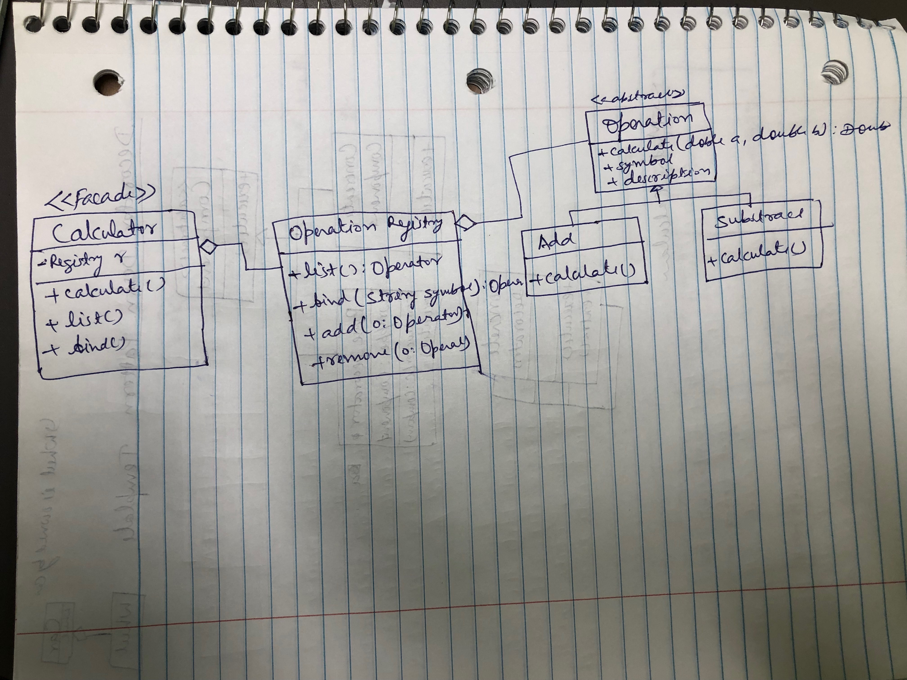

# Problem
Design a math calculator that can be extended by third party developer. Check the `initial-design.js` to understand the simple code and change to achieve following.
- Change behavior both at compile time and at run time
- Easy to extend for new feature

# Proposed Design
- Design `IOperation` interface
- Design `IBinaryOperation` and `IUnaryOperation`
- Design `SumOperation`, `DiffOperation`, `SinOperation`, `CosOperation` concrete implementation.
- Define list of operations in Calculator class

# Reference 
https://www.productivecsharp.com/2012/09/strategy-pattern-basic-calculator/
https://refactoring.guru/design-patterns/strategy