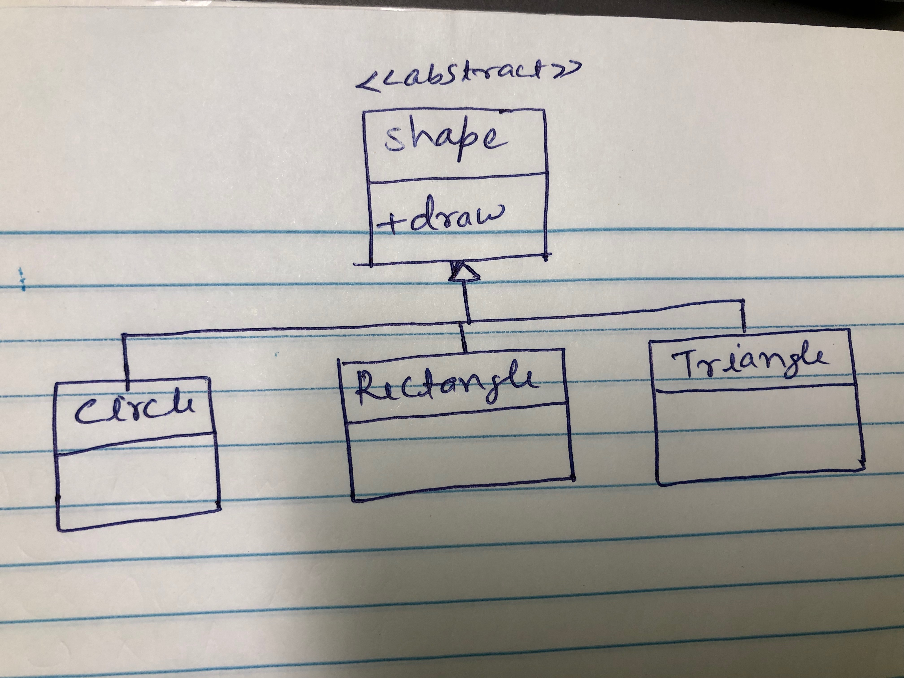
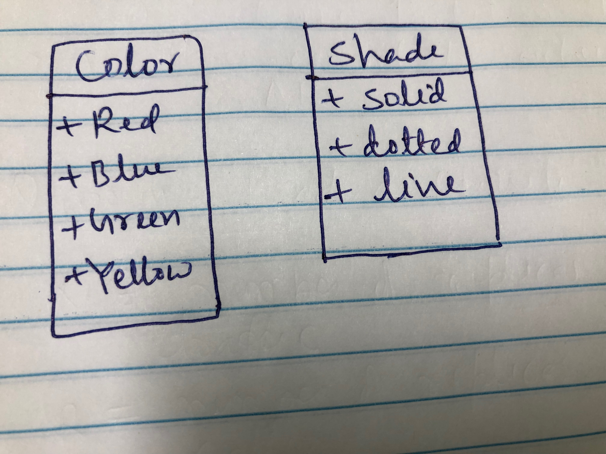
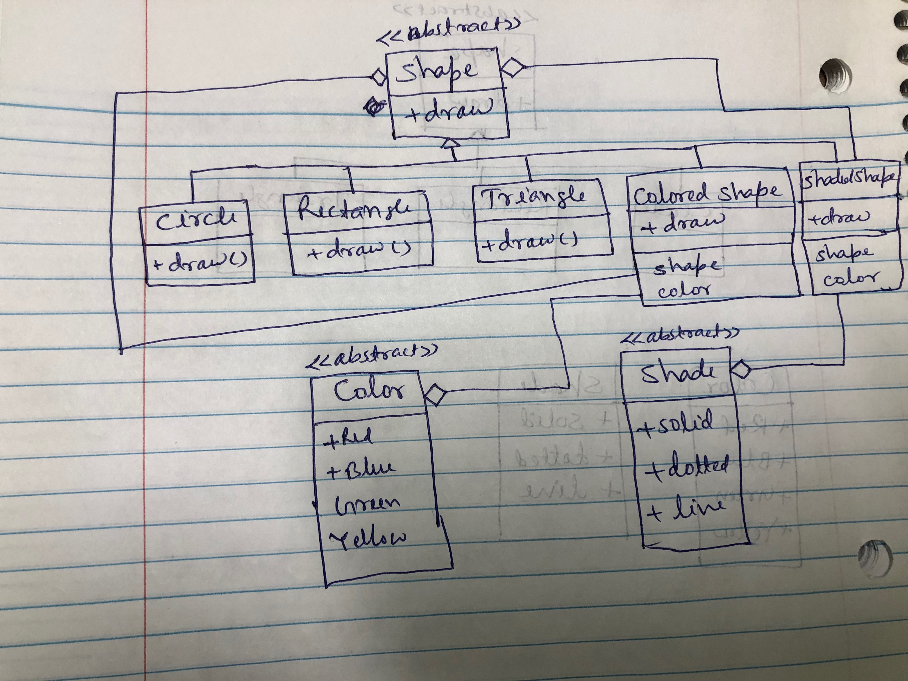

# Problem statement
Widget factory is a startup company which develop software to draw different shape. When company started then developed following shapes
- Circle 
- Rectangle 
- Triangle

Following was design for the app.

After one year of successful business; company wanted to extend widget factory to includes color and shades as below

How to redesign existing class structure with following constraints?
- Do not modify existing class
- Keep new design extensible

# Solution
Following are few things to keep in mind
- Utility/Helper class is bad design
- Designing `GreenCircle`, `RedCircle` are bad design as it will produce many combinations
- Generic wrapper class for eg `ColoredShape` or `ShadedShape` is good idea.

Following is proposed design

- `ColoredShape` inherit `Shape` as well as have composition of `Shape` and `Color`
- `ShadedShape` inherit `Shape` as well as have composition of `Shape` and `Shade`
- This is called decorator/wrapper design pattern where new class decorate existing interface and use compositions

# Design pattern used
- Decorated design pattern
# Decorator design pattern
- Decorator is a structural design pattern that lets you attach new behavior to objects by placing these objects inside special wrapper object that contains the behavior. 

# Reference 
https://refactoring.guru/design-patterns/decorator
